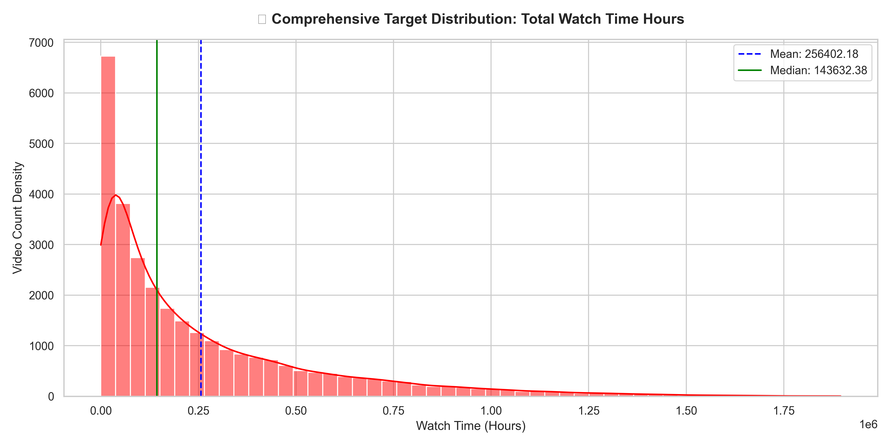
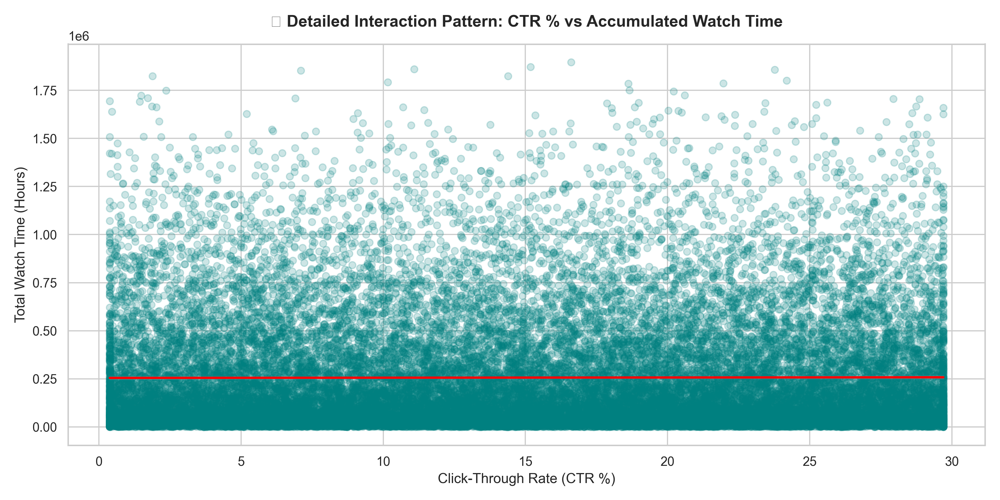
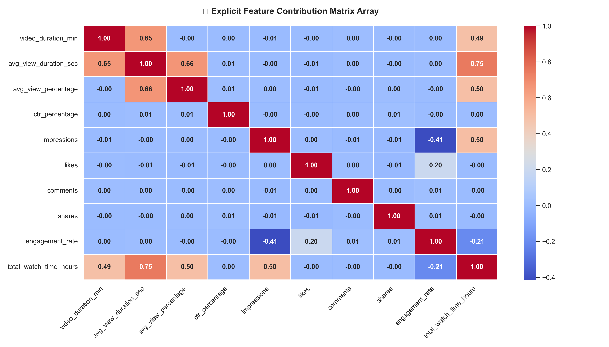

# 🎬 Creator Engagement & Watch-Time Predictive Engine

An end-to-end Machine Learning pipeline and interactive simulation platform designed to forecast YouTube video performance metrics using optimized gradient boosting architectures.

---

## 🎯 Project Overview
Building an audience on digital video platforms traditionally requires manual analysis and intuitive guesswork. This project automates performance forecasting by combining a backend **XGBoost Regressor** with a live **Streamlit** user interface. Creators can dynamically tune target video production metrics—such as thumbnail click-through rate, reach impressions, and base duration—to simulate and optimize watch-time parameters before entering production.

### 🚀 Key Features
* **Predictive Performance Pipeline:** Leverages an optimized XGBoost engine to predict overall performance metrics.
* **Feature Engineering Pipeline:** Transforms baseline creator data into high-value engineered metrics including `engagement_rate` and `avg_view_percentage`.
* **Interactive UI Simulation:** A responsive, live creator workspace utilizing interactive sliders to generate immediate production inference values.
* **Exploratory Data Visualization:** Integrated statistical charts modeling feature distributions, scatter relations, and variable correlations.

---

## 💻 Dashboard Interface

Add a screenshot of your beautiful live running Streamlit interface here to capture immediate attention:
## Interactive Simulation Dashboard


---

## 📊 Automated Data Insights & Evaluation
The machine learning pipeline automatically executes complete Exploratory Data Analysis (EDA) and generates visualization models during training to evaluate feature correlations and target metrics:

### 📉 Feature Performance Matrix

| 📊 1. Watch Time Distribution | 📉 2. CTR vs. Watch Time Scatter |
| :---: | :---: |
|  |  |

| 🌡️ 3. Feature Contribution Heatmap |
| :---: |
|  |

---

## 🛠️ Technology Stack & Dependencies
* **Core Language:** Python
* **Machine Learning Engine:** XGBoost Regressor, Scikit-Learn
* **Data Processing & Analytics:** Pandas, NumPy
* **Interactive UI Layer:** Streamlit framework
* **Data Visualization:** Matplotlib, Seaborn

---

## 🏃‍♂️ Local Installation & Setup Guide

Follow these steps to deploy the application environment locally:

1. **Clone the Repository:**
   ```bash
   git clone [https://github.com/YOUR_GITHUB_USERNAME/YOUR_REPO_NAME.git](https://github.com/YOUR_GITHUB_USERNAME/YOUR_REPO_NAME.git)
   cd youtube_analytics
